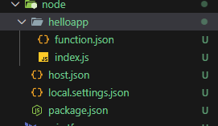

# Azure Functions + HTTP Trigger

## Desplegar funciones 

No se hace automaticamente como en el cdk de aws hay que hacerlo manualmente con los sigueintes codigo
esto sirve mucho para CI/CD y se parar las infra estructura del codigo serverless 

para la funcion serverless debe seguir esta estructura de carpetas y realizar los sigueintes comandos



```bash 
cd /ruta/donde/esta/la/funcion

npm install -g azure-functions-core-tools@4 --unsafe-perm true

func azure functionapp publish func-http-dev
```
